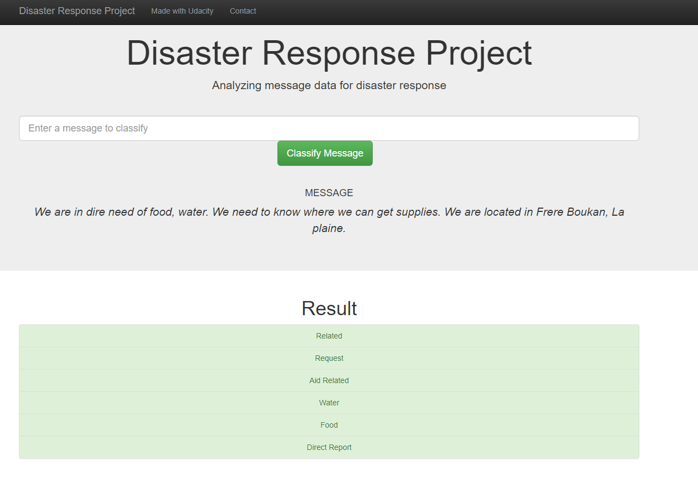

# Disaster Response Pipeline Project
- [Introduction](#Introduction)
- [Installation](#Installation)
- [Project Components](#Project-Components)
- [File Descriptions](#File-Descriptions)
- [Instructions](#Instructions)
- [Results](#Result)
- [Licensing, Authors, Acknowledgements](#License)

## Introduction <a name="Introduction"></a>
The goal of this project is to build an ETL pipeline and NLP pipeline.ETL pipeline to extract the data, clean and transform the data, and load it into a database file.NLP pipeline to process the text data and performs multi-output classification on 36 categories. The project is deployed on to Heroku which can be used during a disaster. The organizations that respond to disasters have the least ability to filter messages when one occurs, in such scenarios this web app can be used to classify the messages. The dataset used in the project is taken from Figure Eight. It is a pre-labeled dataset of tweets and messages sent during real-life disasters. These real-life messages are labeled with 36 different categories.

## Installation <a name="Installation"></a>
The following packages and versions are used for this project
| Package  | Version |
| ------------- | ------------- |
|click|8.0.3|
|colorama|0.4.4|
|Flask|2.0.2|
|greenlet|1.1.2|
|gunicorn|20.1.0|
|itsdangerous|2.0.1|
|Jinja2|3.0.2|
|joblib|1.1.0|
|MarkupSafe|2.0.1|
|nltk|3.6.5|
|numpy|1.21.3|
|pandas|1.3.4|
|plotly|5.3.1|
|python-dateutil|2.8.2|
|pytz|2021.3|
|regex|2021.10.23|
|scikit-learn|1.0.1|
|scipy|1.7.1|
|six|1.16.0|
|sklearn|0.0|
|SQLAlchemy|1.4.26|
|tenacity|8.0.1|
|threadpoolctl|3.0.0|
|tqdm|4.62.3|
|Werkzeug|2.0.2|


## Project Components <a name="Project-Components"></a>
There are 3 main components in this project.
### 1. ETL pipeline
- Load two datasets (disaster_categories.csv and disaster_messages.csv)
- Convert the values in catefories to column names
- Merge the data sets on id and clean the data
- Store the data in a SQLite database

### 2. ML pipeline
- Load the cleaned data from the SQLite database
- Split the data to train-test sets
- Build a Pipeline with custom class to improve the accuracy 
- Use GridSearchCV to find the best parameters
- Evaluate the model
- Save the final model to a pickle file

### 3. Flask Web App
- Load the cleaned data from the SQLite database
- Unpickle the save model
- Use the model to predict the queries using GET method 
- Return the classifications to be rendered on html page




## File Description <a name="File-Descriptions"></a>
This is the high level description of all the files in this project.
```
├── app
│   ├── run.py--------------------------------# Flask file runs the web app
│   └── templates
│       ├── go.html---------------------------# Result page
│       └── master.html-----------------------# Main page
├── data
│   ├── DisasterResponse.db-------------------# *Database storing the processed data
│   ├── disaster_categories.csv---------------# Pre-labelled dataset
│   ├── disaster_messages.csv-----------------# Data
│   └── process_data.py-----------------------# ETL pipeline processing the data
|   
├── models
|   ├── train_classifier.py-------------------# Machine learning pipeline
|   └── classifier.pkl------------------------# *Pickle file
├── web_app
|    ├──app
|    |   ├── templates
|    |   |   ├── go.html---------------------------# Result page
|    |   |   └── master.html-----------------------# Main page
|    |   ├──__init__.py----------------------------# to initilize the flask
|    |   ├──run.py---------------------------------#to run the webapp on heroku
|    |   └──tokenizerrr.py-------------------------# Contains pickle functions needed while unpickling 
|    ├──app1
|    |    ├── __init__.py---------------------------# empty init file to make to folder a package
|    |    └── tokenizerrr.py------------------------# Contains pickle functions needed while pickling 
|    |── data
|    |    ├── DisasterResponse.db-------------------# *Database storing the processed data
|    |    ├── disaster_categories.csv---------------# Pre-labelled dataset
|    |    ├── disaster_messages.csv-----------------# Data
|    |    └── process_data.py-----------------------# ETL pipeline processing the data
|    |── classifier.pkl-----------------------------# Pickle file
|    |── Disasterpipeline.py-------------------------# imports the flask app
|    |── nltk.txt------------------------------------# Needed by to heroku to download NLTK packages
|    |── Procfile------------------------------------#Specifies the commands that are executed by the app on startup
|    |── requirements.txt----------------------------# All the packages and thier version for heroku to download
|    └──train_classifier.py-------------------------# Machine learning pipeline


*Files that will be generated when the python scripts .py are executed.
```


### Instructions:<a name="Instructions"></a>
1. Run the following commands in the project's root directory to set up your database and model.

    - To run ETL pipeline that cleans data and stores in database
        `python data/process_data.py data/disaster_messages.csv data/disaster_categories.csv data/DisasterResponse.db`
    - To run ML pipeline that trains classifier and saves
        `python models/train_classifier.py data/DisasterResponse.db models/classifier.pkl`

2. Navigate to app's directory and run the following command.
    `cd app`
    `python run.py`

3. Go to http://localhost:5555/

## Result <a name="Result"></a>
Click [here](https://dsnd-message-classification.herokuapp.com//) open this project on Heroku

## Licensing, Authors, Acknowledgements <a name="License"></a>
Reference
   https://stackoverflow.com/questions/27732354/unable-to-load-files-using-pickle-and-multiple-modules
   https://stackoverflow.com/questions/40287657/load-pickled-object-in-different-file-attribute-error/40288996
   https://stackoverflow.com/questions/53936736/my-flask-app-does-not-run-on-heroku-but-it-runs-locally/53940109#53940109

* [Figure Eight](https://www.figure-eight.com/) for providing the datasets.
* [Udacity](https://www.udacity.com/) for project goal.
* Author: [G.Vamsi Krishna](https://github.com/Krishna5972)
